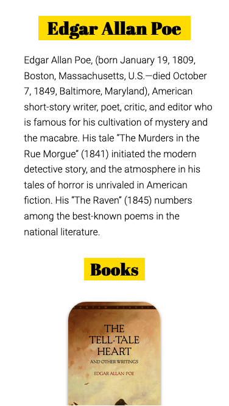
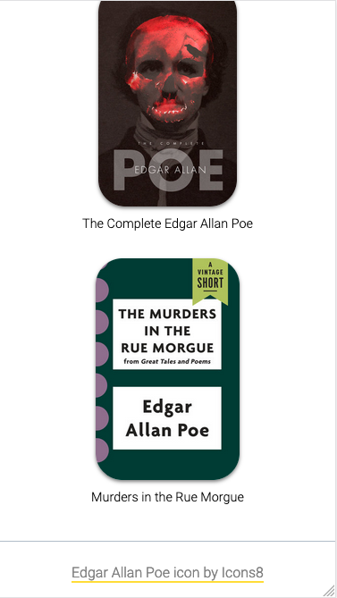

# Tribute Page

I built a tribute page using HTML, CSS, and Javascript. This was my first attempt in trying out responsive web design and... it's quite fun! But it still requires more practice.

## Full Design

 <table>
  <tr>
    <td>Mobile</td>
     <td>Mobile with Navbar</td>
     <td>Mobile with Content</td>
     <td>Mobile with Footer</td>
  </tr>
  <tr>
    <td></td>
    <td></td>
    <td></td>
    <td></td>
  </tr>
 </table>

## Source

Avion School (https://docs.avionschool.com/avn-mcourse/-MYjabeTubdULkJ4UAcG/lessons/project-tribute-page)
